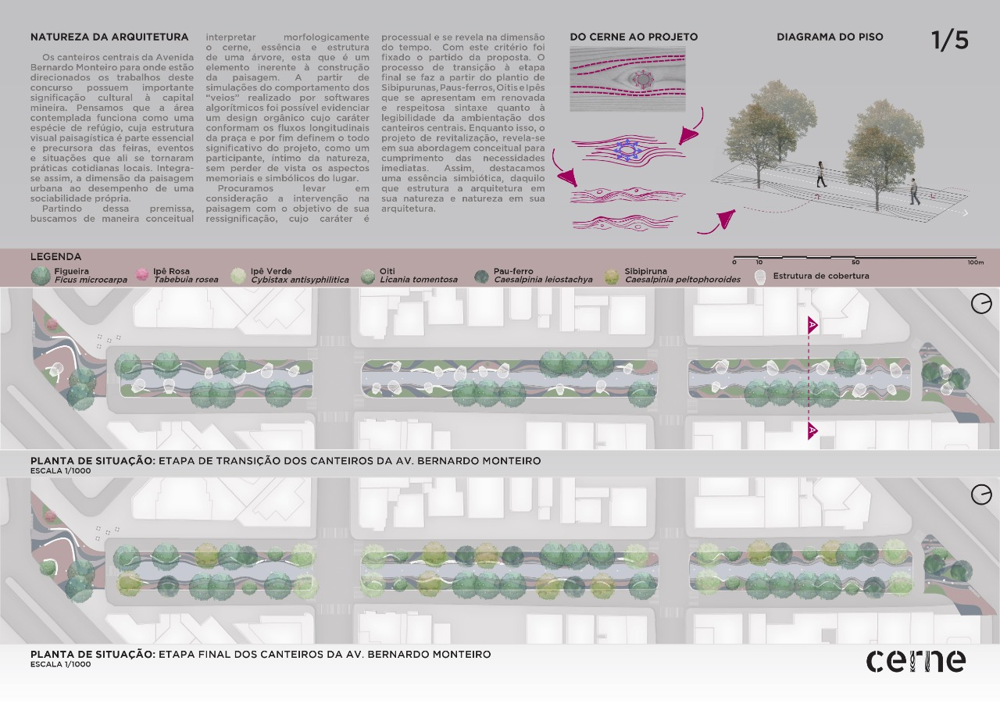
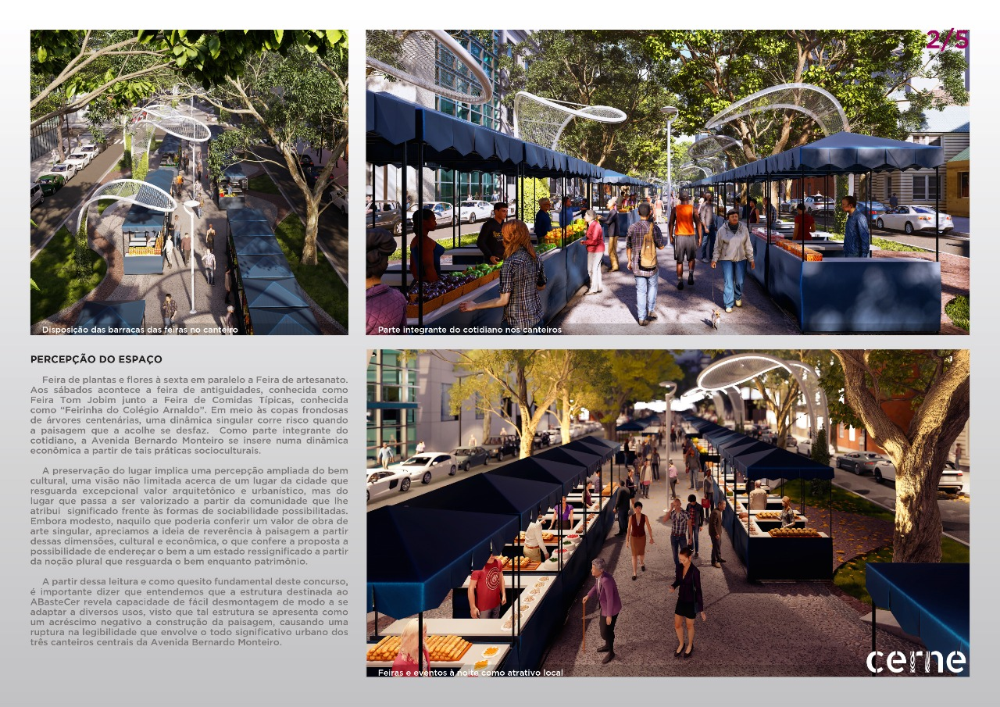
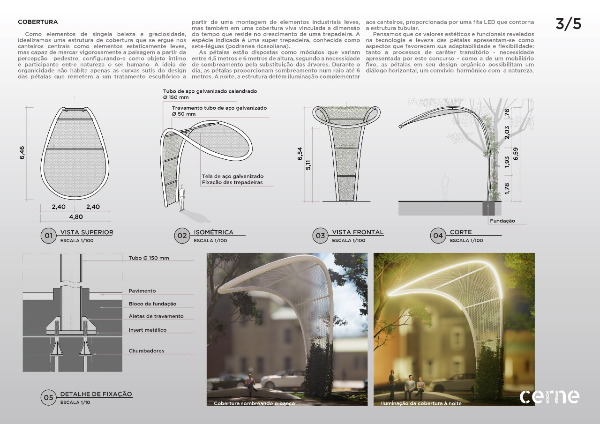
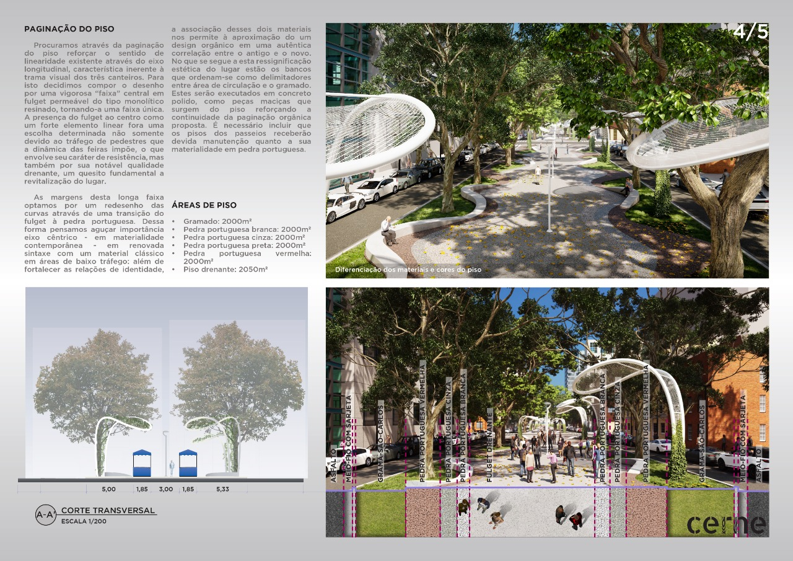
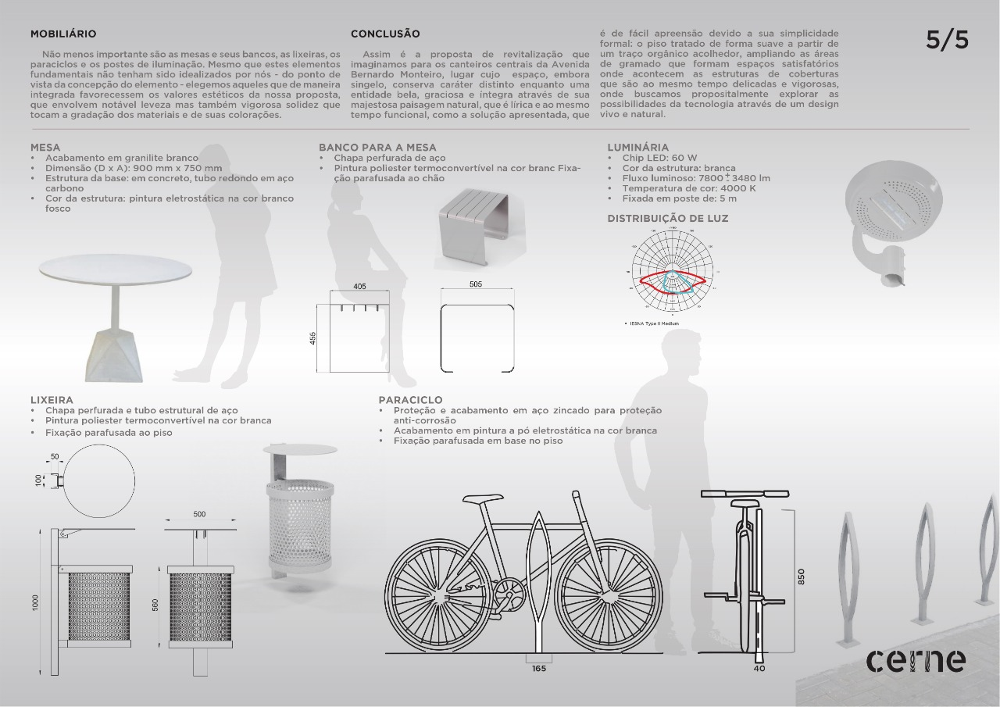

# Concurso Av. Bernardo Monteiro - Belo Horizonte MG

## Colocar texto de apresentação

## Equipe:

#### Arquitetura:

Fernando Ribeiro

Kyane Bomfim

Leonardo Prazeres

Marcela Porto

#### Engenheiro agrônomo:
Antônio Barreto

#### Biólogo: 
Bruno Silva 

#### Engenheiro florestal: 
Caio César Teobaldo

#### Consultoria estrutura:
Olimpo Engenharia

#### Orçamento:
Ceia Projetos e Orçamentos

## Pranchas:

#### Publicado no diário oficial:
[https://prefeitura.pbh.gov.br/sites/default/files/estrutura-de-governo/meio-ambiente/2021/dom-diario-oficial-do-municipio-_extratoata.pdf
](https://prefeitura.pbh.gov.br/sites/default/files/estrutura-de-governo/meio-ambiente/2021/dom-diario-oficial-do-municipio-_extratoata.pdf
)

